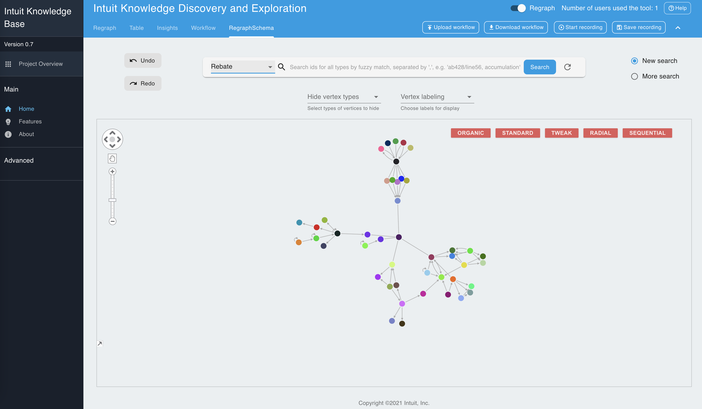

# KG Exploration and Visualization Tool  

## Introduction  
 (Click to play)

The Knowledge Graph Exploration and Visualization Tool is a full-stack web application on the top of TigerGraph services to provide an easy-to-use graphical user interface and get insights into the rich semantics in knowledge graphs. We want to build an easy search interface to discover and visualize what is in the knowledge artifacts.

The tool consists of a Flask service to communicate data with the TigerGraph and a client to render the tool with React, Redux, Axios, ReGraph, Material-UI, etc.

TigerGraph is a tool with multiple graph utilities such as definining the schema, mapping to data, visualizing mappings and querying results. It runs on a Docker image and uses a shared directory between its docker shell and your host OS.
The following instructions are based on the [TigerGraph GitHub Repo](https://github.com/tigergraph/ecosys/blob/master/demos/guru_scripts/docker/README.md) and are arranged here for your convenience.

Features in eight sections:  
- [Schema Layout](#schema-layout)
- [Semantic search](#semantic-search)
- [Graph layout](#graph-layout)
- [Filtering capabilities](#filtering-capabilities)
- [Table view](#table-view)
- [Insights](#insights)
- [Workflow](#workflow)
- [Changing Database](#changing-database)

## Features

*If the resolution is low, you can manually select higher resolution and full screen mode.*
### Schema layout
Schema layout would help you gain insight into the structure of the graphs. 
1. Select and search for a vertex type, highlight neighbors  
     (Click to play)
2. Search for vertex types and highlight all the shortest paths between selected types  
     (Click to play)
3. Graph layout  
     (Click to play)
4. Hide types  
     (Click to play)
5. Hovering and labeling  
     (Click to play)
6. Switch the graphs  
     (Click to play)

### Semantic search
Semantic search is a google-like search tool to help users discover and explore knowledge in the knowledge graph, using spaCy as an NLP engine to semantically translate English queries to GSQL interpreted queries depending on the graph schema. 
1. Search for a word  
     (Click to play)
2. Search for a type  
     (Click to play)
3. Semantic search for a type with keywords  
     (Click to play)
4. Display the English explanation  
     (Click to play)
5. Execute an interpreted query  
     (Click to play)
6. Expand from a vertex  
     (Click to play)
7. Expand with limitation  
     (Click to play)
8. Select vertices  
     (Click to play)
9. Find a shortest path and all shortest paths  
     (Click to play)
10. Find all connections  
     (Click to play)
11. Find paths with limitation  
     (Click to play)
12. New search and more search  
     (Click to play)
13. Reset the graph  
     (Click to play)

### Graph Layout
This is to better display the search results.  
1. Highlight the neighbors and edges from selected vertices, and node style  
     (Click to play)
2. Graph layout  
     (Click to play)
3. Group vertices by types  
     (Click to play)
4. Group the selection and group level  
     (Click to play)
5. Download the image  
     (Click to play)

### Filtering capabilities
This is to help users filter and extract useful information from search results. 
1. Hide types  
     (Click to play)
2. Hide selection and show selection  
     (Click to play)
3. Vertex label  
     (Click to play)
4. Locate vertex  
     (Click to play)

### Table view
Table panel provides a traditional table view grouped by type of vertices. 
1. Table view and select vertices  
     (Click to play)
2. Sort attributes, page and hide vertices  
     (Click to play)

### Insights
The insight panel is to show the statistics of the graph and customized search algorithms.
1. Display the statistics of graphs  
     (Click to play)
2. Customized search for vertices and path exploration  
     (Click to play)

### Workflow
The workflow helps users undo changes, store states, and step through recording to restore data.
1. Undo and redo  
     (Click to play)
2. Save recording and restore recording  
     (Click to play)
3. Start recording and stop recording  
     (Click to play)
4. Restore recording and replay steps  
     (Click to play)
5. Delete recording and download search results  
     (Click to play)
6. Download and upload workflow file  
     (Click to play)

### Changing Database
This tool provides the capabilities to create, update, and delete data in the database. 
1. Create vertex and edit vertex  
     (Click to play)
2. Create edge and edit edge  
     (Click to play)
3. Delete vertex and delete edge  
     (Click to play)
4. Undo/redo and submit  
     (Click to play)
